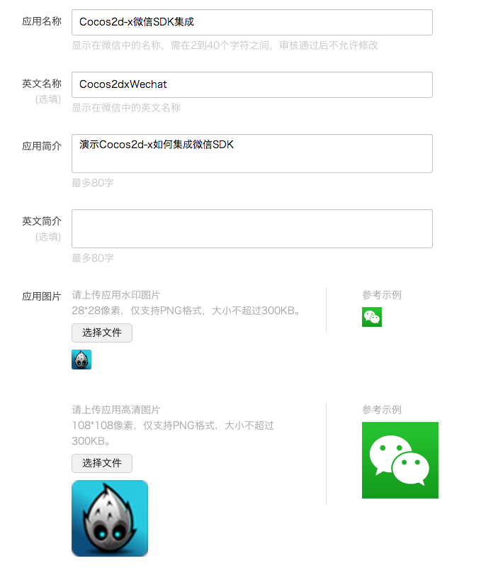
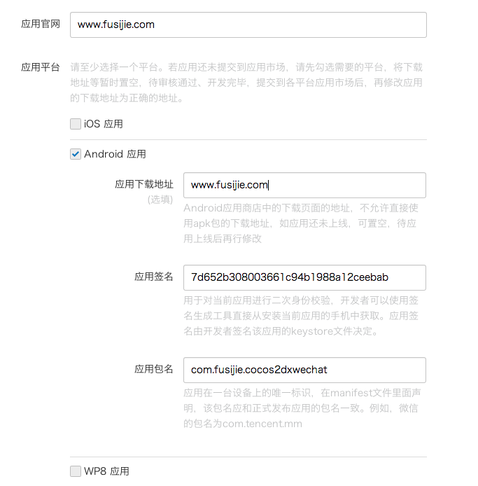
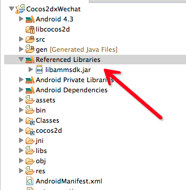
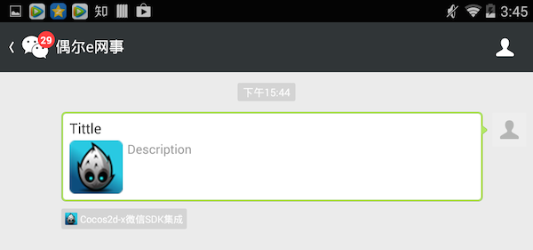
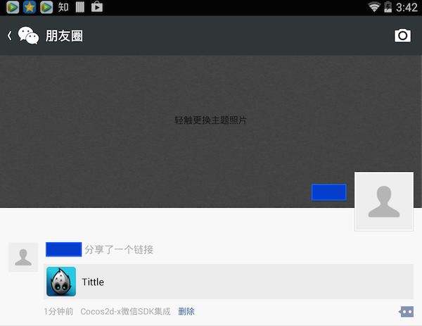

##如何在Cocos2d-x中集成安卓版微信SDK？
---

###1.概述

微信的火热程度已不必说了，如果能在Cocos2d-x中集成微信SDK，让游戏能分享给好友或者朋友圈，那对游戏推广将会是非常有利的。好了，本文就是手把手地教大伙如何在Cocos2d-x中集成微信SDK。

###2.环境

* OS: Mac OSX
* IDE: Xcode v5.11 and Eclipse ADT v22.3
* Android SDK:4.3 
* Adnroid NDK:r9d
* Cocos2d-x 3.2release

###3.创建Cocos2d-x工程

这里不再详述，网上的资料多如牛毛了。这里我按自己习惯的方式来。

（1）命令行创建Cocos2dxWechat项目

	$ cocos new -p com.fusijie.cocos2dxwechat -l cpp -d . Cocos2dxWechat
	
（2）交叉编译生成so文件

	$ cd Cocos2dxWechat/proj.android/
	$ ./build_native.py
	
（3）导入Eclipse生成APK

导入libcocos2dx项目和Cocos2dxWechat项目到Eclipse中。在真机中成功运行Cocos2dxWechat.apk。

###4.申请创建微信应用

这一步主要是在微信开放平台上申请创建移动应用，获取AppID。微信开放平台的网址是：[https://open.weixin.qq.com/](https://open.weixin.qq.com/)

（1）注册帐号，进入管理中心，点击创建移动应用。

（2）第一步是填写应用名，描述，图标等等。如下图。

（3）填写应用官网，勾选Android应用，填写签名，包名等等。如下图。

**注意：**

这里需要特别注意的是应用签名这一项。在第三步的时候，真机中成功运行Cocos2dxWechat.apk之后，我们需要从微信开放平台下载一个签名生成软件[GenSignature](https://open.weixin.qq.com/cgi-bin/frame?t=resource/res_main_tmpl&verify=1&lang=zh_CN&token=2788af648d5164d0feec470a8bfd42f9833ae887)（资源下载->Android资源下载）。

安装签名生成后，打开软件输入游戏包名获取即可。

这里的签名和游戏的包名和keystore是相关联的，如果修改了包名或者更换了keystore，必须同步更新微信开放平台管理中心的信息，防止失效。本示例采用的是debug签名。在完成以上工作后，提交审核即可。说是7天，实际上一般1～2天就审核过了。

###5.集成微信SDK

刚才都是铺垫，这里开始才是进入主题了。要在Cocos2d-x调用微信安卓SDK，Jni跑不掉的。这里只演示如何进行分享到朋友圈和分享给好友，微信SDK还有很多高级的功能，如支付，收藏等等接口，有需要自行[参考文档（移动应用开发）](https://open.weixin.qq.com/cgi-bin/frame?t=resource/res_main_tmpl&verify=1&lang=zh_CN&token=2788af648d5164d0feec470a8bfd42f9833ae887)进行开发。

这里主要分成3部分来解释：

* 微信SDK下载，jar包导入
* Android代码
* C++代码

（1）下载微信SDK

[资源下载->Android资源下载](https://open.weixin.qq.com/cgi-bin/frame?t=resource/res_main_tmpl&verify=1&lang=zh_CN&token=2788af648d5164d0feec470a8bfd42f9833ae887)

（2）打开下载的Android_SDK.zip。解压，将lib目录下的libammsdk.jar拷到Cocos2dxWechat项目下的libs目录。

（3）右键单击工程，选择Build Path中的Configure Build Path...，选中Libraries这个tab，并通过Add Jars...导入工程libs目录下的libammsdk.jar文件。

（4）在AppActivity中添加成员变量

	private static final String APP_ID = "wx81115d2aa55710fa";//AppID，从第四步获取
	private static IWXAPI api;//微信API接口
	private static AppActivity instance;//类静态实例，为了方便后面静态函数的调用

（5）注册到微信

打开AppActivity，在onCreate()中调用regToWX()注册到微信

	protected void onCreate(Bundle savedInstanceState) {
		// TODO Auto-generated method stub
		super.onCreate(savedInstanceState);
		
		instance = this;
		regToWX();
	}

	private void regToWX(){
		api = WXAPIFactory.createWXAPI(this, APP_ID, true);
		api.registerApp(APP_ID);
	}
	
（6）由于这里采用的分享示例传递了一张icon，所以需要额外的一个bitmap的解析类Util类，这个类可以到微信官方SDK demo下载，也可以在本示例中下载（早期的SDK版本这个类是集成在微信SDK中）。icon放在res目录下的drawable目录，我这里偷个懒直接使用了应用icon。

（7）分享给好友

	public static void sendMsgToFriend(){
    	
    	if(api.openWXApp())
    	{
    		WXWebpageObject webpage = new WXWebpageObject();
            webpage.webpageUrl = "http://www.fusijie.com";
            WXMediaMessage msg = new WXMediaMessage(webpage);
            msg.title = "Tittle";
            msg.description = "Description";
            
            Bitmap thumb = BitmapFactory.decodeResource(instance.getResources(), R.drawable.icon);
            msg.thumbData = Util.bmpToByteArray(thumb, true);
             
            SendMessageToWX.Req req = new SendMessageToWX.Req();
            req.transaction = buildTransaction("webpage");
            req.message = msg;
            req.scene = SendMessageToWX.Req.WXSceneSession;
            api.sendReq(req);
    	}
    	else
    	{
    		 Toast.makeText(instance, "未安装微信", Toast.LENGTH_SHORT).show();
    	}
    }
    
（8）分享到朋友圈

    public static void sendMsgToTimeLine(){
    	
    	if(api.openWXApp())
    	{
        	if(api.getWXAppSupportAPI() >= 0x21020001)
        	{        		
        		WXWebpageObject webpage = new WXWebpageObject();
                webpage.webpageUrl = "http://www.fusijie.com";
                WXMediaMessage msg = new WXMediaMessage(webpage);
                msg.title = "Tittle";
                msg.description = "Description";
                
                Bitmap thumb = BitmapFactory.decodeResource(instance.getResources(), R.drawable.icon);
                msg.thumbData = Util.bmpToByteArray(thumb, true);
                 
                SendMessageToWX.Req req = new SendMessageToWX.Req();
                req.transaction = buildTransaction("webpage");
                req.message = msg;
                req.scene = SendMessageToWX.Req.WXSceneTimeline;
                api.sendReq(req);
        	}
        	else{
        		Toast.makeText(instance, "微信版本过低", Toast.LENGTH_SHORT).show();
        	}
        		
    	}
    	else
    	{
    		 Toast.makeText(instance, "未安装微信", Toast.LENGTH_SHORT).show();
    	}
    }

其中buildTransaction()用于生成一个唯一的会话标识符。

	private static String buildTransaction(final String type) {
		return (type == null) ? String.valueOf(System.currentTimeMillis()) : type + System.currentTimeMillis();
	}

代码不难，所以不再逐行解释，可以参考[SDK文档](https://open.weixin.qq.com/zh_CN/htmledition/res/dev/document/sdk/android/index.html)。

（9）JNI调用

在Classes目录下新建一个WeixinShare类，主要包含2个静态函数：

	void WeiXinShare::sendToFriend()
	{
 	#if (CC_TARGET_PLATFORM == CC_PLATFORM_ANDROID) //判断当前是否为Android平台
    JniMethodInfo minfo;
    
    bool isHave = JniHelper::getStaticMethodInfo(minfo,"org/cocos2dx/cpp/AppActivity","sendMsgToFriend", "()V");
    
    if (!isHave) {
        log("jni:sendMsgToFriend is null");
    }else{
        //调用此函数
        minfo.env->CallStaticVoidMethod(minfo.classID, minfo.methodID);
    }
	#endif
}

	void WeiXinShare::sendToTimeLine()
	{
	#if (CC_TARGET_PLATFORM == CC_PLATFORM_ANDROID) //判断当前是否为Android平台
    JniMethodInfo minfo;
    
    bool isHave = JniHelper::getStaticMethodInfo(minfo,"org/cocos2dx/cpp/AppActivity","sendMsgToTimeLine", "()V");
    
    if (!isHave) {
        log("jni:sendMsgToTimeLine is null");
    }else{
        //调用此函数
        minfo.env->CallStaticVoidMethod(minfo.classID, minfo.methodID);
    }
	#endif
}

（10）Cocos2d-x使用

这个就比较简单了，只要包含这个WeiXinShare类，调用这两个静态函数即可。

	void HelloWorld::menuCloseCallback(Ref* pSender)
	{
	#if (CC_TARGET_PLATFORM == CC_PLATFORM_ANDROID)
    //WeiXinShare::sendToFriend();
    WeiXinShare::sendToTimeLine();
	#endif
	}

（11）Android.mk的修改

最后不要忘记修改Android.mk文件。

	LOCAL_SRC_FILES := hellocpp/main.cpp \
                   ../../Classes/AppDelegate.cpp \
                   ../../Classes/HelloWorldScene.cpp \
                   ../../Classes/WeiXinShare.cpp
                   
（12）重新交叉编译，打包为APK即可

###6.效果

分享给好友，点击即可跳转链接：

分享到朋友圈，点击即可跳转链接：

###7.总结

本文写的比较详细，但是也忽略了比如如何接收微信的请求及返回值的说明以及如何进行混淆等等，算是一个初级教程吧。主要是面向对jni调用，第三方安卓sdk集成不太了解的朋友。这里虽然只是针对微信sdk的部分功能集成进行说明，但是道理都是共通的，如何集成微博分享，如何集成第三方广告等等，用类似的方法都可以实现。

本demo的[下载地址](https://github.com/fusijie/Cocos2dx-Wechat)。

